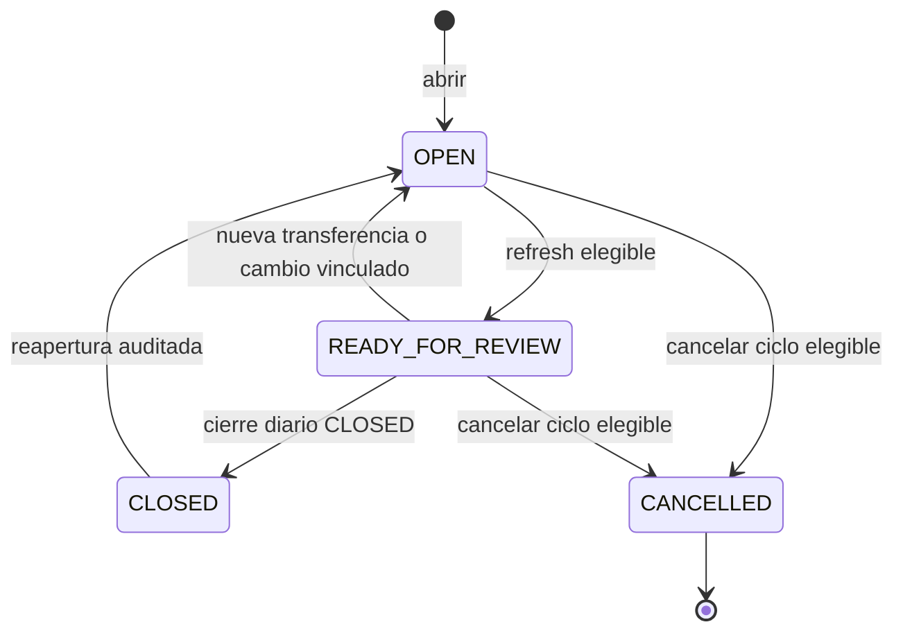
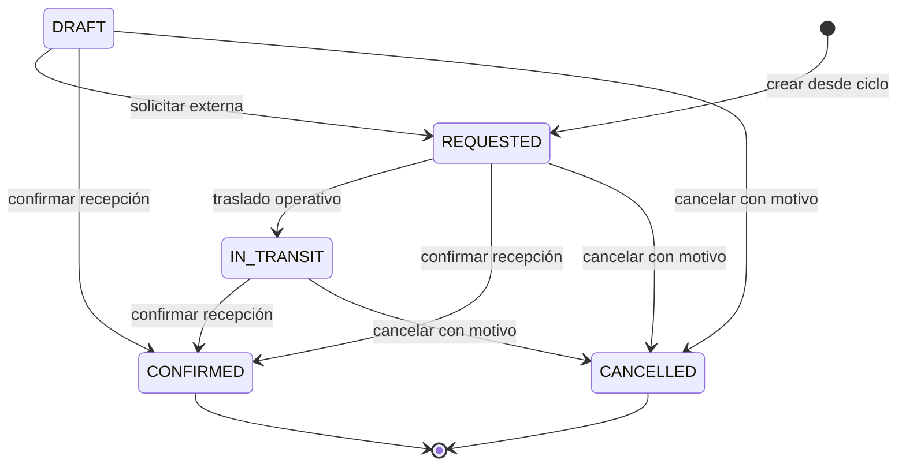

# Diagrama de estados: CEDIS-sucursal

## Ciclo



- `OPEN` admite suministros, devoluciones y refresh.
- `READY_FOR_REVIEW` exige suministro confirmado, cero pendientes e integridad válida. Una nueva operación permitida lo devuelve a `OPEN`.
- `CLOSED` solo se obtiene al cerrar el `PointOfSaleDailyClose` relacionado.
- `CANCELLED` exige motivo, ausencia de cierre activo y todas las transferencias canceladas.
- `CLOSED` y `CANCELLED` son de solo lectura para operaciones del ciclo.

## Transferencia vinculada



`DRAFT`, `REQUESTED` e `IN_TRANSIT` no cambian stock. `CONFIRMED` aplica salida/entrada en una sola transacción y no puede cancelarse. El ciclo no redefine estos estados: observa y protege el traspaso vinculado.

## Cierre relacionado

```text
Daily close DRAFT -> REVIEWED -> CLOSED
Cycle      OPEN  -> READY     -> CLOSED

Reopen: Daily close CLOSED -> DRAFT; Cycle CLOSED -> OPEN
```
