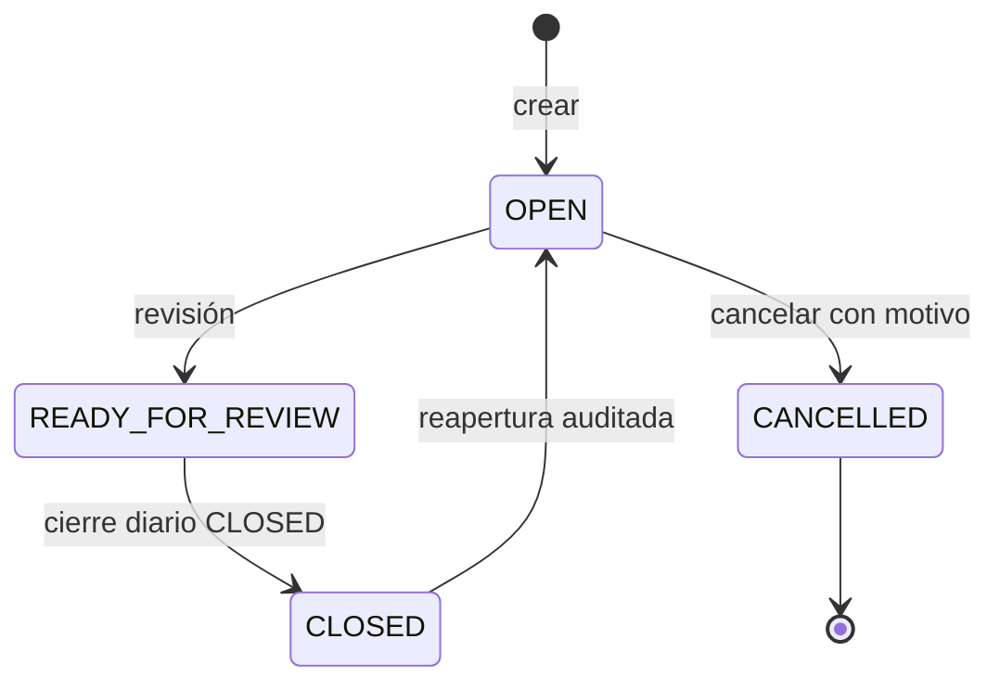
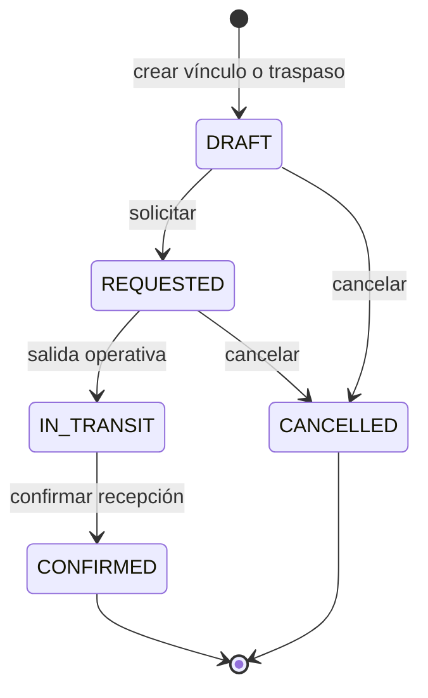

# Diagrama de estados: CEDIS-sucursal

## Ciclo



Reglas:

- `OPEN` admite vínculos y comandos mientras el cierre relacionado sea inexistente o `DRAFT`.
- `READY_FOR_REVIEW` exige suministro confirmado, cero transferencias pendientes e integridad válida.
- `CLOSED` exige cierre `CLOSED` con versión vigente.
- `CANCELLED` es final.
- `CLOSED` no tiene endpoint propio: se obtiene dentro de `PointOfSaleDailyCloseService.close`.

## Traspaso vinculado



Un traspaso `CONFIRMED` es terminal en el MVP: no se cancela ni se revierte desde el ciclo. Una corrección posterior usa el dominio de inventario autorizado.

## Cierre diario relacionado

```text
DRAFT -> REVIEWED -> CLOSED
  |                  |
  +-> CANCELLED      +-> DRAFT (reapertura ADMIN)
```

El ciclo no redefine estas transiciones. Solo añade precondiciones de suministro/integridad y sincroniza `OPEN`/`CLOSED` dentro de la misma transacción.
